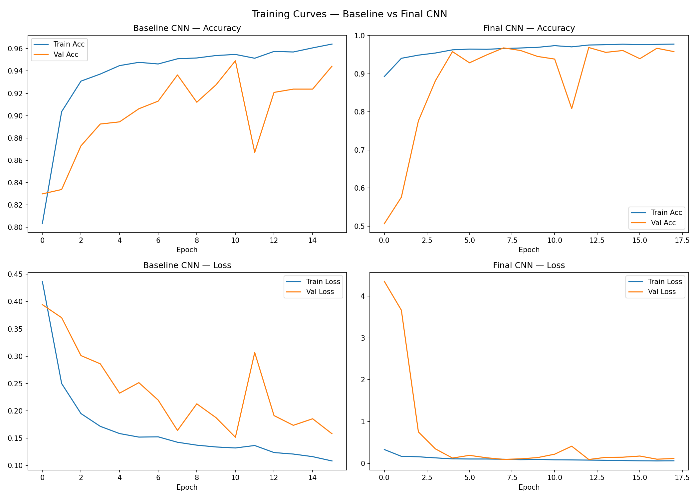
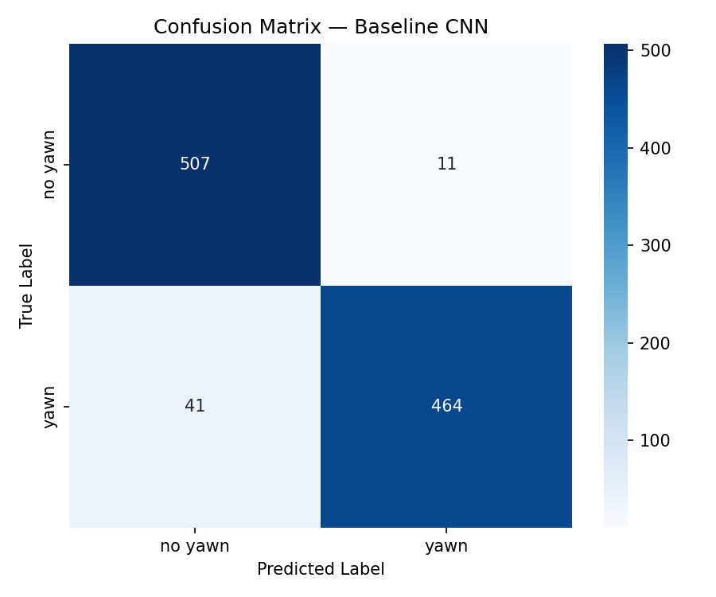
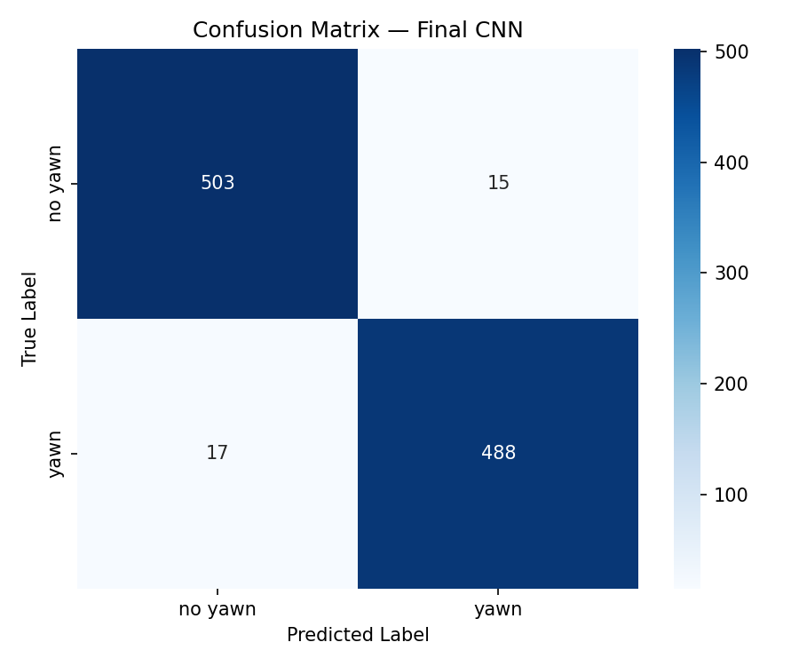

# 🚗 Driver Drowsiness Detection System
### Real-Time Fatigue Monitoring Using Computer Vision and Deep Learning

> Preventing fatigue-related road accidents by detecting drowsiness indicators in real time — no specialized hardware required, just a standard webcam.

---

## 📌 Project Overview

Driver fatigue is responsible for approximately **20% of fatal road accidents** worldwide. Unlike alcohol impairment, drowsiness is invisible — there is no roadside test for it, and by the time a driver notices they are falling asleep, it is often too late.

This project builds a **real-time Driver Drowsiness Detection System** that monitors a driver's face through a webcam and triggers an audio/visual alert the moment sustained fatigue is detected. Two physiological signals are monitored simultaneously:

- **Eye closure** — detected geometrically using the Eye Aspect Ratio (EAR) algorithm applied to MediaPipe facial landmarks
- **Yawning** — classified by a custom-trained Convolutional Neural Network (CNN) on cropped mouth regions

**Datasets used:**

| Signal | Dataset | Size | Description |
|--------|---------|------|-------------|
| Eye state | [MRL Eye Dataset](http://mrl.cs.vsb.cz/eyedataset) | ~84,000 images | Open/closed eyes, including subjects with glasses |
| Yawning | [Kaggle Yawn Dataset](https://www.kaggle.com/datasets/davidvazquezcic/yawn-dataset) | ~2,900 images | Labeled yawning / non-yawning face crops |

---

## 🏗️ Architecture

The system uses a **two-component pipeline**:

### Component 1 — Eye State: Eye Aspect Ratio (EAR)

Eye closure is computed **geometrically** — no neural network is needed here. Using **MediaPipe Face Landmarker**, we extract 6 precise landmark points around each eye per frame and apply the EAR formula:

```
EAR = (||p2–p6|| + ||p3–p5||) / (2 × ||p1–p4||)
```

- Normal open eye → EAR ≈ 0.30–0.40
- Closed eye → EAR < **0.23** (our threshold)

EAR is averaged over a **rolling window of 7 frames** to eliminate false triggers from natural blinks.

### Component 2 — Yawning: Custom CNN (`mouth_cnn.h5`)

We trained a **custom Convolutional Neural Network** on 80×80 RGB mouth-region crops extracted from the Kaggle Yawn Dataset. The architecture was designed in two stages — a baseline first, then an improved final model:

#### Baseline CNN (2 blocks — no regularization)
| Layer | Details |
|-------|---------|
| Conv2D (16 filters) + MaxPooling | Basic feature extraction |
| Conv2D (32 filters) + MaxPooling | Pattern detection |
| Dense (64) → Dense (1, sigmoid) | Binary output |

#### Final CNN (3 blocks — with BatchNorm & Dropout)
| Layer | Details |
|-------|---------|
| Conv2D (16 filters, 3×3) + **BatchNorm** + MaxPooling | Low-level lip edge detection |
| Conv2D (32 filters, 3×3) + **BatchNorm** + MaxPooling | Intermediate mouth shape features |
| Conv2D (64 filters, 3×3) + **BatchNorm** + MaxPooling | High-level open/closed mouth patterns |
| Dense (128) + **Dropout (0.4)** | Prevents overfitting |
| Dense (1, sigmoid) | Yawn probability ∈ [0, 1] |

- **Loss function:** Binary Cross-Entropy
- **Optimizer:** Adam (lr = 1e-3)
- **Input:** 80×80×3 normalized RGB mouth crop
- **Output:** score > 0.5 → yawning

### Full Detection Pipeline

```
Webcam Frame
     │
     ▼
MediaPipe Face Landmarker
     │
     ├──► 6 eye landmarks ──► EAR ──► Temporal smoothing (7 frames) ──► Eye closed?
     │                                                                         │
     └──► Mouth ROI crop ──► CNN ──► Temporal smoothing (7 frames) ──►   Yawning?
                                                                               │
                                                          Eyes closed > 1.8s  OR  Yawning detected
                                                                               │
                                                                    ⚠️ ALERT (audio + visual)
```

---

## 📊 Results

### Baseline vs. Final Model

| Model | Validation Accuracy | Correct / Total | Notes |
|-------|-------------------|-----------------|-------|
| Baseline CNN | 94.9% | 971 / 1,023 | Unstable — val loss spikes throughout training |
| **Final CNN** | **96.9%** | **991 / 1,023** | Stable — clean convergence, no overfitting |

The final CNN correctly classified **991 out of 1,023** validation samples, reducing total errors from **52 → 32** compared to the baseline.

**F1-Score breakdown (Final CNN):**

| Class | Precision | Recall | F1-Score | Support |
|-------|-----------|--------|----------|---------|
| No Yawn | 96.7% | 97.1% | **0.97** | 518 |
| Yawn | 97.0% | 96.6% | **0.97** | 505 |
| **Weighted Avg** | | | **0.97** | 1,023 |

> F1-scores computed from the confusion matrix values: No Yawn (503 TP, 15 FP, 17 FN) / Yawn (488 TP, 17 FP, 15 FN).

### Training Curves — Baseline vs. Final CNN



The **Baseline CNN** (left) shows an unstable validation loss that spikes repeatedly across epochs, and a growing gap between training and validation accuracy — a clear sign of overfitting. The **Final CNN** (right) converges cleanly: validation loss drops to near zero and validation accuracy stabilizes at ~93–95%, with no significant divergence from training accuracy.

### Confusion Matrices

| Baseline CNN | Final CNN |
|:---:|:---:|
|  |  |

The final model reduced misclassifications by **38%** compared to the baseline (52 errors → 32 errors). The remaining errors are primarily:
- **False negatives (17):** partial or suppressed yawns where the mouth opening is too subtle for the CNN to exceed the 0.5 threshold
- **False positives (15):** wide-mouth expressions such as laughing or talking, which are visually similar to yawning

---

## ▶️ How to Run

### 1. Clone the repository
```bash
git clone https://github.com/VilyaPoghosyan/Driver-Drowsiness-Detection.git
cd Driver-Drowsiness-Detection
```

### 2. Install dependencies
```bash
pip install -r requirements.txt
```

### 3. Run real-time detection (webcam)
```bash
python drowsiness_detect.py
```
Press **Q** to quit. The system opens your webcam and displays live eye/mouth state. An audio alarm fires when drowsiness is sustained for more than 1.8 seconds.

### 4. Run inference on a single static image ⭐
```bash
python predict.py --image path/to/face_image.jpg
```

**Example output:**
```
==================================================
   DROWSINESS DETECTION — INFERENCE RESULT
==================================================
  Eye State    : OPEN (AWAKE)           (EAR: 0.312)
  Mouth State  : YAWNING                | Confidence: 87.4%
--------------------------------------------------
  Final Verdict: DROWSY — Yawning detected
==================================================
```

### 5. Configuration
All thresholds and paths are adjustable in `config.py`:

| Parameter | Default | Description |
|-----------|---------|-------------|
| `EAR_THRESHOLD` | 0.23 | EAR below this → eye considered closed |
| `CLOSED_EYE_SECONDS` | 1.8 | Sustained closure duration before alert |
| `YAWN_THRESHOLD` | 0.5 | CNN confidence above this → yawning |
| `EAR_HISTORY` | 7 | Temporal smoothing window (frames) |
| `MOUTH_HISTORY` | 7 | Temporal smoothing window (frames) |

---

## 🗂️ Project Structure

```
Driver-Drowsiness-Detection/
├── drowsiness_detect.py    # Main real-time detection (entry point)
├── predict.py              # Standalone inference on a static image
├── train.py                # Training script — baseline + final CNN
├── config.py               # All hyperparameters and paths
├── eye_utils.py            # EAR formula and eye landmark indices
├── mouth_utils.py          # Mouth ROI extraction and preprocessing
├── alert.py                # Audio alert system
├── mouth_cnn.h5            # Trained CNN weights
├── face_landmarker.task    # MediaPipe face landmark model
├── requirements.txt
├── sounds/
│   └── alarm.wav
└── results/
    ├── training_curves.png
    ├── confusion_matrix_baseline_cnn.png
    └── confusion_matrix_final_cnn.png
```

---

## 🛠️ Tech Stack

| Component | Technology |
|-----------|------------|
| Language | Python 3.9+ |
| Deep Learning | TensorFlow / Keras |
| Face Landmarks | MediaPipe Face Landmarker |
| Computer Vision | OpenCV |
| Audio Alerts | Pygame |
| Numerics | NumPy |

---

## 📄 License
This project is licensed under the [MIT License](LICENSE).