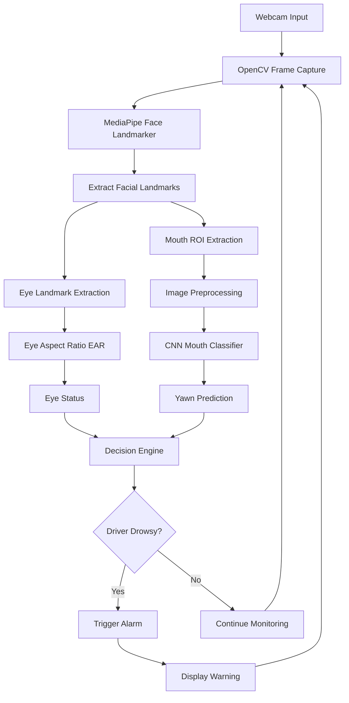

# 🚘 Driver Drowsiness Detection using Computer Vision & Deep Learning

> A real-time intelligent driver monitoring system that detects fatigue by combining **facial landmark analysis** with **deep learning-based yawn recognition**. The application continuously monitors eye closure and yawning patterns through a standard webcam and issues instant alerts when drowsiness is detected.


---

# 📖 Overview

Driver fatigue remains one of the leading causes of road accidents. This project introduces a lightweight, camera-based monitoring system capable of identifying early signs of drowsiness without requiring specialized hardware.

Instead of relying on a single indicator, the system combines two complementary signals:

- 👁️ Eye closure detection using **Eye Aspect Ratio (EAR)**
- 😮 Yawning recognition using a **Convolutional Neural Network (CNN)**

The outputs from both modules are temporally smoothed to reduce false positives before triggering an audio warning.

---

# ✨ Key Features

- 🎥 Real-time webcam monitoring
- 👁️ Eye Aspect Ratio (EAR) based blink & eye-closure analysis
- 🧠 CNN-based mouth classification for yawn detection
- 📍 MediaPipe Face Landmarker integration
- 🔊 Automatic alarm system for sustained drowsiness
- 📊 Model training pipeline
- 📈 Performance visualization using confusion matrices & learning curves
- ⚡ Lightweight architecture suitable for edge devices

---

# 🛠 Tech Stack

| Category | Technology |
|-----------|------------|
| Language | Python |
| Computer Vision | OpenCV |
| Face Detection | MediaPipe Face Landmarker |
| Deep Learning | TensorFlow / Keras |
| Numerical Computing | NumPy |
| Visualization | Matplotlib |
| Evaluation | Scikit-learn |

---

# 📂 Project Structure

```text
Driver-Drowsiness-Detection/
│
├── alert.py                 # Alarm management
├── config.py                # Thresholds & configuration
├── drowsiness_detect.py     # Real-time detection pipeline
├── eye_utils.py             # EAR calculations
├── mouth_utils.py           # Mouth ROI preprocessing
├── predict.py               # Single-image inference
├── train.py                 # CNN training script
├── mouth_cnn.h5             # Trained mouth classifier
├── face_landmarker.task     # MediaPipe model
├── sounds/
│   └── alarm.wav
├── results/
│   ├── training_curves.png
│   ├── confusion_matrix_baseline_cnn.png
│   └── confusion_matrix_final_cnn.png
└── requirements.txt
```

---

# 🏗 System Architecture


## 🏗 System Architecture


```

---

# ⚙️ Detection Pipeline

### Step 1 — Face Localization

MediaPipe detects facial landmarks from each incoming frame.

↓

### Step 2 — Eye Analysis

The Eye Aspect Ratio (EAR) is computed from eye landmarks.

Low EAR over a sustained duration indicates prolonged eye closure.

↓

### Step 3 — Mouth Analysis

The mouth region is cropped and passed through a trained CNN that predicts:

- Yawning
- Not Yawning

↓

### Step 4 — Temporal Filtering

Recent predictions are stored inside rolling history buffers to stabilize results and reduce noise.

↓

### Step 5 — Alert Generation

If eye closure duration and/or yawning confidence exceed configured thresholds, an audible alarm is triggered.

---

# 🧠 Machine Learning Pipeline

Training consists of:

1. Image preprocessing
2. Data augmentation
3. CNN training
4. Validation
5. Model evaluation
6. Model serialization (`mouth_cnn.h5`)

Training includes:

- Horizontal flipping
- Rotation
- Zoom augmentation
- Width/height shifting
- Normalization

---

# 🚀 Installation

Clone the repository

```bash
git clone https://github.com/<username>/Driver-Drowsiness-Detection.git

cd Driver-Drowsiness-Detection
```

Install dependencies

```bash
pip install -r requirements.txt
```

---

# ▶️ Run Real-Time Detection

```bash
python drowsiness_detect.py
```

---

# 🧪 Train the CNN

```bash
python train.py --data_dir path/to/dataset
```

---

# 🔍 Predict on a Single Image

```bash
python predict.py --image sample.jpg
```

---

# ⚙️ Configuration

The following parameters can be modified inside `config.py`.

| Parameter | Purpose |
|------------|----------|
| EAR_THRESHOLD | Eye closure threshold |
| CLOSED_EYE_SECONDS | Minimum eye closure duration |
| YAWN_THRESHOLD | CNN confidence threshold |
| EAR_HISTORY | Temporal smoothing window |
| MOUTH_HISTORY | Mouth prediction history |

---

# 📊 Outputs

During execution, the application displays:

- Live webcam feed
- Eye status
- Mouth status
- Drowsiness warning
- Alarm activation

Training generates:

- Learning curves
- Confusion matrices
- Classification metrics

---

# 📈 Future Improvements

- Head pose estimation
- Blink frequency analysis
- Mobile deployment
- Night vision support
- Multi-face monitoring
- Driver attention estimation
- Eye gaze tracking
- TensorFlow Lite optimization

---

# 💡 Applications

- Smart vehicles
- Driver assistance systems
- Fleet safety monitoring
- Commercial transport
- Public transportation
- Research in intelligent transportation
- Human behavior analysis

---

# 🤝 Contributing

Contributions are welcome.

1. Fork the repository
2. Create a feature branch

```bash
git checkout -b feature/new-feature
```

3. Commit your changes

```bash
git commit -m "Add new feature"
```

4. Push

```bash
git push origin feature/new-feature
```

5. Open a Pull Request

---

# 📄 License

This project is released under the MIT License.

---

# 👨‍💻 Author

**Priyansu Sikdar**

If you found this project useful, consider giving it a ⭐ on GitHub.
